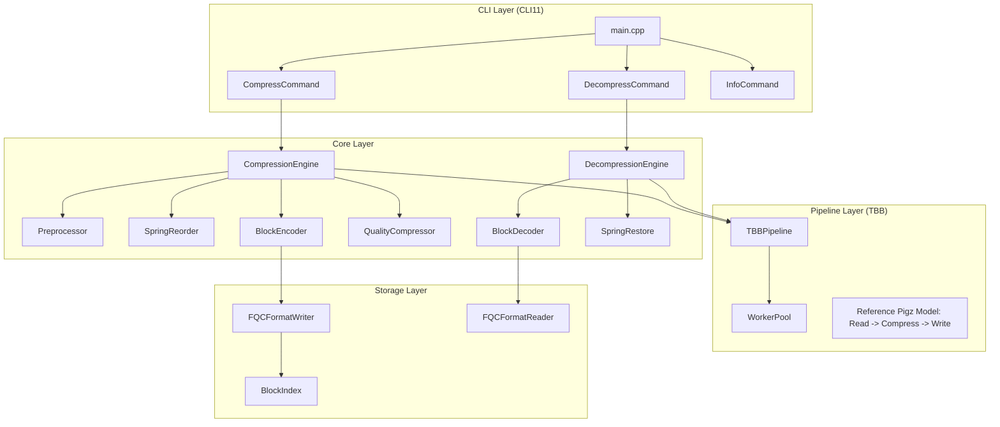

# Design Document: fq-compressor

## Overview

fq-compressor 是一个高性能 FASTQ 文件压缩工具，结合 Spring 的先进压缩算法和 fastq-tools 的现代化框架。本设计文档描述系统架构、组件接口、数据模型和实现策略。

### 设计目标

1.  **高压缩比**: 复用 **Spring** 的 reads 重排序和编码算法，参考 **Repaq** 的紧凑设计。
2.  **高性能**: 基于 **Intel TBB** 的并行流水线处理 (参考 **Pigz** 的 Producer-Consumer 模型)。
3.  **模块化**: 清晰的接口设计，支持多种压缩后端。
4.  **现代化**: C++20 标准，RAII 内存管理，Concepts 约束。
5.  **随机访问**: 支持基于 Block 的随机读取 (Scheme A)。

### 技术栈

| 类别 | 技术选型 | 说明 |
|------|----------|------|
| 语言标准 | **C++20** | Concepts, Ranges, Coroutines |
| 构建系统 | **CMake 3.20+** | Modern CMake 最佳实践 |
| 并发框架 | **Intel oneTBB** | `parallel_pipeline`, `task_group` |
| CLI 解析 | **CLI11** | 现代化、功能丰富的命令行库 |
| 日志系统 | **Quill** | 极低延迟异步日志 (Low Latency Logging) |
| 压缩库 | **Spring (Core)**, libdeflate, bzip2, xz | 混合压缩策略 |
| 测试框架 | Google Test + RapidCheck | 单元测试 + 属性测试 |
| 依赖管理 | Conan 2.x | 依赖包管理 |

## Architecture

### 系统架构图



### 关键参考项目架构借鉴

1.  **Spring**: 采用其 "Reads Reordering" 和 "Quality Lossy Compression" 算法核心。在 fq-compressor 中，我们将 Spring 的全局上下文改为 **Block Context**，以便每 N 条 Reads 重置一次状态，实现随机访问。
2.  **Pigz**: 借鉴其并行设计。主线程读文件 -> 分块提交给 TBB 线程池压缩 -> 输出线程按顺序写入文件。
3.  **Repaq / FQZComp5**: 参考其算术编码和上下文模型优化，特别是对 metadata (IDs) 的压缩处理。

## Archive Format Design (.fqc)

文件结构设计为支持流式写入和随机访问读取。

### File Layout

```
+----------------+
|  Magic Header  |  (8 bytes)
+----------------+
| Global Header  |  (Variable Length)
+----------------+
|    Block 0     |
+----------------+
|    Block 1     |
+----------------+
|      ...       |
+----------------+
|    Block N     |
+----------------+
|   Block Index  |  (Variable Length)
+----------------+
|  File Footer   |  (Fixed Length)
+----------------+
```

### 1. Magic Header
- `Magic`: `0x89 'F' 'Q' 'C' 0x0D 0x0A 0x1A 0x0A` (参考 PNG/XZ 风格魔法数)
- `Version`: 1 byte (e.g., 0x01)

### 2. Global Header
包含全局元数据：
- `Flags` (uint32):
    - bit 0: `IS_PAIRED`: 配对端数据
    - bit 1: `PRESERVE_ORDER`: 是否保留原始 Reads 顺序 (0=Reordered, 1=Original)
    - bit 2: `LONG_READ_MODE`: 长读模式
    - bit 3-4: `QUALITY_MODE`:
        - 00: Lossless (Default)
        - 01: Illumina Binning 8
        - 10: QVZ Lossy
        - 11: Discard Quality
    - bit 5-6: `ID_MODE`:
        - 00: Preserve Exact (Default)
        - 01: Tokenized/Reconstruct (Split static/dynamic parts)
        - 10: Discard/Indexed (Replace with 1,2,3...)
- `CompressionAlgo` (uint8): 主要算法 ID (Spring, LZMA, etc.)
- `OriginalFilenameLength` (uint16)
- `OriginalFilename` (string)
- `Timestamp` (uint64)

### 3. Block Structure
为了支持 "Scheme A" (Random Access)，数据被分割为独立的块。每个块可以独立解压（除了可能的共享静态字典）。

### 3. Block Structure (Columnar Storage)
采用**列式存储** (Columnar Storage) 思想，将 Block Payload 划分为独立的子流 (Sub-streams)，每个子流单独压缩。

```cpp
struct Block {
    BlockHeader header;
    // Concat of compressed streams:
    // [Stream ID][Stream Seq][Stream Qual][Stream Aux]
};

struct BlockHeader {
    uint32_t block_id;
    uint64_t block_xxhash64;
    uint32_t uncompressed_count; // Number of reads
    
    // Stream Offsets (Relative to Payload Start)
    uint32_t offset_id;
    uint32_t offset_seq;
    uint32_t offset_qual;
    uint32_t offset_aux; // Optional (e.g., Read lengths if variable)
    
    // Stream Codecs (Compression Strategy Flags)
    uint8_t codec_id;   // e.g., Delta + LZMA
    uint8_t codec_seq;  // e.g., Spring Reorder + Arithmetic
    uint8_t codec_qual; // e.g., QVZ + Range
};
```

**Stream Definitions**:
1.  **Identifier Stream**:
    -   *Strategy*: Tokenization -> Delta Encoding -> General Compressor (LZMA/Zstd).
    -   *Why*: IDs (e.g., `@Illumina...:1:1:1:1`) often differ only by last integer. Delta encoding handles this efficiently.
2.  **Sequence Stream**:
    -   *Strategy*: **Assembly-based Compression (ABC)** (State-of-the-Art).
    -   *Implementation Path*: **Spring Core Fork**.
        -   **Stage 1: Minimizer Bucketing**: 使用 K-mer Minimizers 将 Reads 分桶。
        -   **Stage 2: Reordering**: 桶内重排序 (Approximate Hamiltonian Path)。
        -   **Stage 3: Consensus & Delta**: 生成局部共识，编码差异 (Subs/Indels)。
        -   **Stage 4: Quantization**: 差异数据送入 BSC 或 Arithmetic Coder。
    -   *Why*: 这是 Spring/Mincom 证明过的最优解。我们将 fork Spring 的核心算法 (`RefGen` / `Encoder`) 并改造为支持 `ResetContext(Block)` 的接口，从而在保持高压缩率的同时获得随机访问能力。
3.  **Quality Stream**:
    -   *Strategy*: **Statistical Context Mixing (SCM)** (Ref: Fqzcomp5).
    -   *Why*: 质量值具有高频率波动特性，Assembly-based 方法效果不佳。Fqzcomp5 的上下文模型 (Context Model) 是目前处理质量值的最佳实践。我们将实现一个类似的 Order-1 预测模型。


### 4. Block Index (At End)
支持快速定位。
- `NumBlocks` (uint64)
- `IndexEntries`: Array of `struct { uint64_t offset; uint64_t read_id_start; }`，其中 `read_id_start` 以归档存储顺序计数（若 `PRESERVE_ORDER=0` 则为重排后顺序）

### 5. File Footer
- `IndexOffset` (uint64): 索引开始的位置。
- `GlobalChecksum` (XXHASH64): 整个文件的校验和。
- `MagicEnd`: "FQC_EOF"

## Components and Interfaces

### 1. CLI 模块 (fqc_cli)
使用 **CLI11** 替代 cxxopts。

```cpp
#include <CLI/CLI.hpp>
// ...
CLI::App app{"fq-compressor: High performance FASTQ compressor"};
app.add_option("-i,--input", input_file, "Input file");
app.add_option("-t,--threads", threads, "Number of threads");
// ...
```

### 2. Logger 模块
使用 **Quill**。

```cpp
// include/fqc/common/logger.h
#include <string_view>
#include <quill/Quill.h>

namespace fqc::log {
    void init(std::string_view log_file, quill::LogLevel level);
    // 全局 Logger 实例
}
```

### 3. IO 与格式处理

- I/O 压缩格式分阶段支持：Phase 1（plain/gzip），Phase 2（bzip2/xz）。

```cpp
// include/fqc/format/fqc_writer.h
namespace fqc::format {
    class FQCWriter {
    public:
        void write_global_header(const GlobalHeader& header);
        void write_block(const BlockData& block); // Thread-safe or serialized
        void finalize(); // Write index and footer
    private:
        std::vector<IndexEntry> index_;
    };
}
```

### 4. 并行压缩流水线 (Pipeline)

```cpp
// include/fqc/pipeline/compressor.h
class CompressionPipeline {
public:
    // TBB Filter Design
    // 1. ReaderFitler (Serial) -> Produces Chunks of Reads
    // 2. CompressFilter (Parallel) -> Compresses Chunks to Blocks (Spring Algo)
    // 3. WriterFilter (Serial) -> Writes Blocks to Disk
    void run();
};
```

## Correctness & Verification

### 完整性校验设计
1.  **输入完整性**: 读取 FASTQ 时校验基本格式。
2.  **块校验**: 每个 Block 解压后对比 `block_xxhash64`。
3.  **全局校验**: 整个文件流对比 `GlobalChecksum`。
4.  **Reference Verification**: `ref-projects/Spring` 的算法输出应与本工具核心算法输出一致（在由本工具适配 Block 接口后）。

## Development Phases

1.  **Phase 1: Skeleton & Format**: 搭建 CMake, 引入 CLI11/Quill, 定义文件格式读写器。
2.  **Phase 2: Integration**: 移植/适配 Spring 核心算法，使其支持 Block 模式。
3.  **Phase 3: Pipeline**: 实现 TBB 流水线。
4.  **Phase 4: Optimization**: 引入 pigz 思想优化 IO，引入 Repaq 思想优化重排。
5.  **Phase 5: Verification**: 全面测试 (Unit, Property, Integration)。
