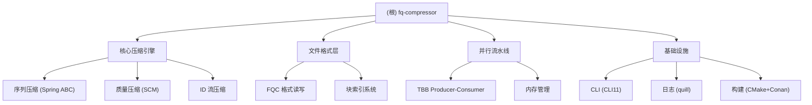

# fq-compressor

> 高性能 FASTQ 压缩工具，支持随机访问

## 项目愿景

fq-compressor 是一个面向测序时代的高性能下一代 FASTQ 压缩工具。它结合了**基于组装的无参考压缩（Assembly-based Compression，ABC）**策略与工业级工程实践，旨在实现极高的压缩比、快速的并行处理以及原生随机访问能力。

## 架构总览



## 模块索引

| 模块 | 职责 | 状态 |
|------|------|------|
| **FASTQ 解析器** | FASTQ 格式解析与验证 | 设计中 |
| **FQC 格式** | 自定义压缩文件格式，支持随机访问 | 设计中 |
| **序列压缩 (ABC)** | Spring 风格的重排序与共识编码 | 待集成 |
| **质量压缩 (SCM)** | fqzcomp5 风格的上下文混合压缩 | 待实现 |
| **TBB 流水线** | Intel oneTBB 并行处理框架 | 待实现 |
| **CLI 接口** | 命令行工具 (CLI11) | 设计中 |

## 运行与开发

### 构建依赖

- **C++ 编译器**: GCC 12+ 或 Clang 17+
- **构建系统**: CMake 3.20+ + Ninja
- **依赖管理**: Conan 2.x
- **C++ 标准**: C++20

### 构建命令

```bash
# 使用 GCC 构建发布版
./scripts/build.sh gcc Release

# 使用 Clang 构建调试版
./scripts/build.sh clang Debug

# 运行测试
./scripts/test.sh -c clang -t Release
```

### 主要依赖

| 依赖 | 用途 |
|------|------|
| Intel oneTBB | 并行处理流水线 |
| CLI11 | 命令行参数解析 |
| quill | 高性能日志库 |
| zlib-ng / zstd / libdeflate | 通用压缩后端 |
| fmt | 格式化库 |

## 测试策略

项目设计阶段，测试策略将在实现阶段确定。计划使用：

- **单元测试**: Google Test
- **属性测试**: 用于格式往返一致性验证
- **性能基准**: 自定义基准测试框架
- **集成测试**: 端到端压缩/解压验证

## 编码规范

- **C++ 标准**: C++20，使用现代特性（Ranges、Concepts）
- **代码风格**: `.clang-format` 配置
- **静态分析**: `.clang-tidy` 配置
- **提交规范**: Commitlint (Conventional Commits)

### 关键配置

- **列限制**: 100 字符
- **缩进**: 4 空格
- **换行符**: LF
- **头文件包含顺序**: 项目头文件 > 标准库 > 系统头文件

## AI 使用指引

### 项目状态

当前项目处于**设计阶段**，尚未开始编码实现。主要产出包括：

1. **可行性分析** (`docs/01_feasibility_analysis.md`)
2. **策略评估** (`docs/02_strategy_evaluation.md`)
3. **算法选择** (`docs/03_algorithm_selection.md`)
4. **设计评审** (`docs/reivew/`)
5. **CI/CD 配置** (`.github/workflows/`)

### 推荐的开发路线图

```
Phase 0: Technical Spike (可选, 2-3 天)
  └─ 验证 Spring 集成可行性

Phase 1: Skeleton & Format (2-3 周)
  ├─ 项目初始化、CMake、Conan
  ├─ FQC 格式读写器
  ├─ FASTQ 解析器
  └─ CLI 框架

Phase 2: Spring 集成 (4-6 周, 高风险)
  ├─ 两阶段压缩策略实现
  ├─ 质量值压缩 (SCM)
  ├─ ID 流压缩 (Delta + Tokenization)
  └─ 内存管理模块

Phase 3: TBB 流水线 (2-3 周)
  ├─ 并行压缩/解压
  └─ 性能优化

Phase 4: 扩展功能 (2-3 周)
  ├─ Long Read 支持
  ├─ Paired-End 支持
  └─ bzip2/xz 输入支持

Total: 12-17 周 (约 3-4 个月)
```

### 参考项目

- **Spring**: 核心重排序和编码逻辑
- **fqzcomp5**: 质量分数压缩模型
- **fastq-tools**: 高性能 C++ 框架和 I/O
- **pigz**: 并行实现参考

## 变更记录

| 日期 | 操作 | 说明 |
|------|------|------|
| 2026-01-15 | 初始化 | 项目 AI 上下文初始化 |
