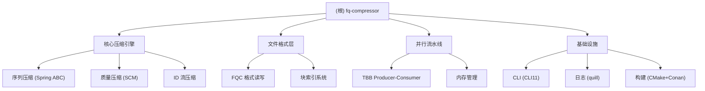

# fq-compressor

> 高性能 FASTQ 压缩工具，支持随机访问

## 项目愿景

fq-compressor 是一个面向测序时代的高性能下一代 FASTQ 压缩工具。它结合了**基于组装的无参考压缩（Assembly-based Compression，ABC）**策略与工业级工程实践，旨在实现极高的压缩比、快速的并行处理以及原生随机访问能力。

## 架构总览



## 模块索引

| 模块 | 职责 | 状态 |
|------|------|------|
| **FASTQ 解析器** | FASTQ 格式解析与验证 | ✅ 已完成 (100%) |
| **FQC 格式定义** | 自定义压缩文件格式，支持随机访问 | ✅ 已完成 (100%) |
| **序列压缩 (ABC)** | Spring 风格的重排序与共识编码 | ⚠️ 部分完成 (80%) |
| **质量压缩 (SCM)** | fqzcomp5 风格的上下文混合压缩 | ⚠️ 部分完成 (90%) |
| **ID 流压缩** | Delta + Tokenization 压缩 | ⚠️ 部分完成 (90%) |
| **TBB 流水线** | Intel oneTBB 并行处理框架 | ⚠️ 框架存在 (40%) |
| **CLI 框架** | 命令行参数解析 (CLI11) | ✅ 已完成 (100%) |
| **压缩命令** | compress 核心逻辑 | ❌ 占位符 (5%) |
| **解压命令** | decompress 核心逻辑 | ❌ 占位符 (5%) |
| **错误处理** | 异常与Result<T>系统 | ✅ 已完成 (100%) |
| **日志系统** | Quill高性能日志 | ✅ 已完成 (100%) |
| **内存管理** | 内存预算追踪 | ✅ 已完成 (100%) |

**总体进度**: 约 60% (基础设施完善,核心算法基本完成,集成层缺失)

## 运行与开发

### 构建依赖

- **C++ 编译器**: GCC 12+ 或 Clang 17+
- **构建系统**: CMake 3.20+ + Ninja
- **依赖管理**: Conan 2.x
- **C++ 标准**: C++20

### 构建命令

```bash
# 使用 GCC 构建发布版
./scripts/build.sh gcc Release

# 使用 Clang 构建调试版
./scripts/build.sh clang Debug

# 运行测试
./scripts/test.sh -c clang -t Release

# 压缩示例
./build/fq-compressor compress input.fastq -o output.fqc

# 解压示例
./build/fq-compressor decompress input.fqc -o output.fastq
```

### 命令行接口 (CLI)

| 命令 | 用途 |
|------|------|
| `compress` | FASTQ 压缩 |
| `decompress` | FQC 解压 |
| `info` | 文件统计信息 |
| `verify` | 完整性验证 |

### 常用参数

| 参数 | 说明 | 默认值 |
|------|------|--------|
| `-i, --input` | 输入文件 | 必填 |
| `-o, --output` | 输出文件 | 必填 |
| `-t, --threads` | 并行线程数 | CPU 核心数 |
| `--memory-limit` | 内存限制 (MB) | 8192 |
| `-l, --level` | 压缩级别 | 5 |

### 主要依赖

| 依赖 | 用途 |
|------|------|
| Intel oneTBB | 并行处理流水线 |
| CLI11 | 命令行参数解析 |
| quill | 高性能日志库 |
| zlib-ng / zstd / libdeflate | 通用压缩后端 |
| fmt | 格式化库 |

### 依赖版本 (Conan)

| 依赖 | 版本 | 用途 |
|------|------|------|
| cli11 | 2.4.2 | CLI 解析 |
| quill | 11.0.2 | 日志 |
| onetbb | 2022.3.0 | 并行处理 |
| zlib-ng | 2.3.2 | 压缩 |
| zstd | 1.5.7 | 压缩 |
| libdeflate | 1.25 | 压缩 |

## 测试策略

**测试框架已完成**, 包括:

- **单元测试**: Google Test (34个测试用例已实现)
- **属性测试**: RapidCheck (50+属性测试已设计)
- **性能基准**: GCC vs Clang编译器对比框架
- **集成测试**: E2E测试脚本 (test_cli.sh, test_performance.sh)

**测试数据**: 2.27M条Illumina short reads (157MB, `/workspace/fq-data/`)

**当前状态**: 测试框架完善,等待核心功能实现后运行验证

## FQC 格式设计

FQC 是项目的自定义压缩格式，支持随机访问：

```
┌─────────────────────────────────────────────┐
│  File Header (64 bytes)                      │
├─────────────────────────────────────────────┤
│  Block 1 (e.g., 10MB)                        │
│  ├─ Block Header (32 bytes)                  │
│  ├─ ID Stream (Delta + Tokenized)            │
│  ├─ Sequence Stream (ABC Encoded)            │
│  └─ Quality Stream (SCM Encoded)             │
├─────────────────────────────────────────────┤
│  Block 2                                     │
├─────────────────────────────────────────────┤
│  ...                                         │
├─────────────────────────────────────────────┤
│  Reorder Map (Optional)                      │
├─────────────────────────────────────────────┤
│  Block Index                                 │
├─────────────────────────────────────────────┤
│  File Footer (32 bytes)                      │
└─────────────────────────────────────────────┘
```

### Read 长度分类

| 类型 | 条件 | 压缩策略 |
|------|------|----------|
| **Short** | max <= 511 且 median < 1KB | Spring ABC + 全局重排序 |
| **Medium** | max > 511 或 1KB <= median < 10KB | Zstd，禁用重排序 |
| **Long** | median >= 10KB 或 max >= 10KB | Zstd，禁用重排序 |

## 编码规范

- **C++ 标准**: C++20，使用现代特性（Ranges、Concepts）
- **代码风格**: `.clang-format` 配置
- **静态分析**: `.clang-tidy` 配置
- **提交规范**: Commitlint (Conventional Commits)

### 关键配置

- **列限制**: 100 字符
- **缩进**: 4 空格
- **换行符**: LF
- **头文件包含顺序**: 项目头文件 > 标准库 > 系统头文件

## AI 使用指引

### 项目状态

**当前进度**: 约 60% 完成 (2026-01-27 更新)

**已完成部分**:
- ✅ 设计文档: 可行性分析、策略评估、算法选择、评审报告
- ✅ 核心算法: BlockCompressor(1626行)、QualityCompressor(911行)、IDCompressor(1054行)、GlobalAnalyzer(802行) - 共4735行算法代码
- ✅ 基础设施: FASTQ解析器、FQC格式定义、错误处理、日志系统、内存管理
- ✅ CLI框架: CLI11集成完成
- ✅ 测试框架: 34个单元测试、50+属性测试、Benchmark框架
- ✅ CI/CD配置

**未完成部分** (主要是集成层):
- ❌ compress命令核心逻辑 (目前只写8字节魔数, 见 `/workspace/docs/ISSUES.md` ISSUE-P0-001)
- ❌ decompress命令核心逻辑 (目前只写注释, 见 ISSUE-P0-002)
- ❌ FQCWriter/Reader 的实际使用集成
- ⚠️ TBB并行流水线 (框架存在,节点逻辑部分完成)

**核心问题**: 项目有优秀的核心引擎,但缺少集成胶水代码将各模块串联起来 (详见 `docs/ISSUES.md`)

**修复计划**: 详见 `docs/04_implementation_status.md` 和 `/home/developer/.claude/plans/prancy-napping-moonbeam.md`

### 推荐的开发路线图

```
Phase 0: Technical Spike (可选, 2-3 天)
  └─ 验证 Spring 集成可行性

Phase 1: Skeleton & Format (2-3 周)
  ├─ 项目初始化、CMake、Conan
  ├─ FQC 格式读写器
  ├─ FASTQ 解析器
  └─ CLI 框架

Phase 2: Spring 集成 (4-6 周, 高风险)
  ├─ 两阶段压缩策略实现
  ├─ 质量值压缩 (SCM)
  ├─ ID 流压缩 (Delta + Tokenization)
  └─ 内存管理模块

Phase 3: TBB 流水线 (2-3 周)
  ├─ 并行压缩/解压
  └─ 性能优化

Phase 4: 扩展功能 (2-3 周)
  ├─ Long Read 支持
  ├─ Paired-End 支持
  └─ bzip2/xz 输入支持

Total: 12-17 周 (约 3-4 个月)
```

### 参考项目

- **Spring**: 核心重排序和编码逻辑
- **fqzcomp5**: 质量分数压缩模型
- **fastq-tools**: 高性能 C++ 框架和 I/O
- **pigz**: 并行实现参考

## 常见问题 (FAQ)

### Q: 项目目前处于什么阶段？

A: **开发中后期** (约60%完成)。核心算法模块(4735行代码)已基本完成,基础设施完善,但命令集成层存在35个占位符待实现。详细进度见 `docs/04_implementation_status.md` 和 `docs/ISSUES.md`。

### Q: 为什么选择 Spring ABC 而非其他算法？

A: Spring 的 ABC 策略在短读数据上能达到接近有参考压缩的比率，同时保持无参考的灵活性。

### Q: 如何处理长读数据？

A: 长读数据（max > 511bp）会自动切换到 Zstd 压缩策略，因为 Spring ABC 对长读收益有限。

### Q: 项目许可证是什么？

A: 计划使用 MIT 许可证，但 Spring 依赖可能导致非商业限制（待最终确认）。

## 相关文件清单

### 设计文档

- `docs/01_feasibility_analysis.md` - 可行性分析
- `docs/02_strategy_evaluation.md` - 策略评估
- `docs/03_algorithm_selection.md` - 算法选择
- `docs/reivew/*.md` - 设计评审报告

### 构建配置

- `CMakePresets.json` - CMake 预设
- `conanfile.py` - Conan 依赖配置
- `.clang-format` - 代码格式
- `.clang-tidy` - 静态检查
- `.github/workflows/` - CI/CD 配置

### 开发脚本

- `scripts/build.sh` - 构建脚本
- `scripts/test.sh` - 测试脚本
- `scripts/lint.sh` - 代码检查脚本

## 变更记录

| 日期 | 操作 | 说明 |
|------|------|------|
| 2026-01-27 | 状态诊断 | 修正项目状态描述,实际进度约60%,详见docs/ISSUES.md |
| 2026-01-15 | 初始化 | 项目 AI 上下文初始化 |
