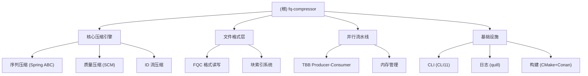

# fq-compressor

> 高性能 FASTQ 压缩工具，支持随机访问

## 项目愿景

fq-compressor 是一个面向测序时代的高性能下一代 FASTQ 压缩工具。它结合了**基于组装的无参考压缩（Assembly-based Compression，ABC）**策略与工业级工程实践，旨在实现极高的压缩比、快速的并行处理以及原生随机访问能力。

## 架构总览


```mermaid
graph TD
    A["(根) fq-compressor"] --> B["核心压缩引擎"];
    A --> C["文件格式层"];
    A --> D["并行流水线"];
    A --> E["基础设施"];

    B --> B1["序列压缩 (Spring ABC)"];
    B --> B2["质量压缩 (SCM)"];
    B --> B3["ID 流压缩"];

    C --> C1["FQC 格式读写"];
    C --> C2["块索引系统"];

    D --> D1["TBB Producer-Consumer"];
    D --> D2["内存管理"];

    E --> E1["CLI (CLI11)"];
    E --> E2["日志 (quill)"];
    E --> E3["构建 (CMake+Conan)"];

    click B1 "./docs/03-algorithm-selection.md" "查看序列压缩设计"
    click C1 "./docs/02-strategy-evaluation.md" "查看格式设计"
```

## 模块索引

| 模块 | 职责 | 状态 |
|------|------|------|
| **FASTQ 解析器** | FASTQ 格式解析与验证，支持 PE | ✅ 已完成 |
| **FQC 格式定义** | 自定义压缩文件格式，支持随机访问 | ✅ 已完成 |
| **序列压缩 (ABC)** | Spring 风格的重排序与共识编码 | ✅ 已完成 |
| **质量压缩 (SCM)** | fqzcomp5 风格的上下文混合压缩 | ✅ 已完成 |
| **ID 流压缩** | Delta + Tokenization 压缩 | ✅ 已完成 |
| **TBB 流水线** | Intel oneTBB 并行处理框架 (8个节点) | ✅ 已完成 |
| **CLI 框架** | 命令行参数解析 (CLI11) | ✅ 已完成 |
| **压缩命令** | compress 核心逻辑 | ✅ 已完成 |
| **解压命令** | decompress 核心逻辑 | ✅ 已完成 |
| **info 命令** | 文件统计信息 | ✅ 已完成 |
| **verify 命令** | 完整性验证 | ✅ 已完成 |
| **错误处理** | 异常与Result<T>系统 | ✅ 已完成 |
| **日志系统** | Quill高性能日志 | ✅ 已完成 |
| **内存管理** | 内存预算追踪 | ✅ 已完成 |
| **异步 I/O** | AsyncReader/AsyncWriter/BufferPool | ✅ 已完成 |
| **压缩流** | 多格式压缩/解压流 (gzip/bzip2/xz/zstd) | ✅ 已完成 |

**代码规模**: 62 个源文件 (28 src + 23 headers + 11 tests)，约 27,000 行代码

## 运行与开发

### 构建依赖

- **C++ 编译器**: GCC 15+ 或 Clang 20+
- **构建系统**: CMake 3.28+ + Ninja
- **依赖管理**: Conan 2.x
- **C++ 标准**: C++23

### Docker 工具链选型

| 组件 | 选型 | 理由 |
|------|------|------|
| **基础镜像** | `gcc:15.2-bookworm` (Debian 12) | Docker 官方 GCC 镜像，自带 GCC 15.2，无需额外编译 |
| **Clang** | Clang 20 (via `apt.llvm.org`) | LLVM 最新稳定发布版，C++23 支持最完整 |
| **运行时镜像** | `debian:bookworm-slim` | 与构建镜像同系，共享基础层，体积最小 |
| **不选 Ubuntu 24.04** | — | 无官方 `gcc:` 镜像，需自行编译 GCC 15；glibc 2.39 二进制兼容性较窄 |

### 构建命令

```bash
# 使用 GCC 构建发布版
./scripts/build.sh gcc-release

# 使用 Clang 构建调试版
./scripts/build.sh clang-debug

# 运行测试
./scripts/test.sh gcc-release

# 压缩示例
./build/gcc-release/src/fqc compress input.fastq -o output.fqc

# 解压示例
./build/gcc-release/src/fqc decompress input.fqc -o output.fastq
```

### 命令行接口 (CLI)

| 命令 | 用途 |
|------|------|
| `compress` | FASTQ 压缩 |
| `decompress` | FQC 解压 |
| `info` | 文件统计信息 |
| `verify` | 完整性验证 |

### 常用参数

| 参数 | 说明 | 默认值 |
|------|------|--------|
| `-i, --input` | 输入文件 | 必填 |
| `-o, --output` | 输出文件 | 必填 |
| `-t, --threads` | 并行线程数 | CPU 核心数 |
| `--memory-limit` | 内存限制 (MB) | 8192 |
| `-l, --level` | 压缩级别 | 5 |

### 主要依赖

| 依赖 | 用途 |
|------|------|
| Intel oneTBB | 并行处理流水线 |
| CLI11 | 命令行参数解析 |
| quill | 高性能日志库 |
| zlib-ng / zstd / libdeflate | 通用压缩后端 |
| fmt | 格式化库 |

### 依赖版本 (Conan)

| 依赖 | 版本 | 用途 |
|------|------|------|
| cli11 | 2.4.2 | CLI 解析 |
| quill | 11.0.2 | 日志 |
| fmt | 12.1.0 | 格式化 |
| onetbb | 2022.3.0 | 并行处理 |
| zlib-ng | 2.3.2 | gzip 压缩 |
| bzip2 | 1.0.8 | bzip2 压缩 |
| xz_utils | 5.4.5 | xz/LZMA 压缩 |
| zstd | 1.5.7 | zstd 压缩 |
| libdeflate | 1.25 | 快速 gzip 压缩 |
| xxhash | 0.8.3 | 校验和 |
| gtest | 1.15.0 | 单元测试 |

## 测试策略

- **单元测试**: Google Test
- **属性测试**: RapidCheck
- **性能基准**: GCC vs Clang 编译器对比框架
- **E2E 测试**: 端到端压缩/解压测试

### 测试文件

| 文件 | 覆盖模块 |
|------|----------|
| `tests/algo/id_compressor_property_test.cpp` | ID 压缩 |
| `tests/algo/long_read_property_test.cpp` | 长读压缩 |
| `tests/algo/pe_property_test.cpp` | Paired-End |
| `tests/algo/quality_compressor_property_test.cpp` | 质量压缩 |
| `tests/algo/two_phase_compression_property_test.cpp` | 两阶段压缩 |
| `tests/common/memory_budget_test.cpp` | 内存管理 |
| `tests/format/fqc_format_property_test.cpp` | FQC 格式 |
| `tests/format/fqc_writer_test.cpp` | FQC 写入 |
| `tests/io/fastq_parser_property_test.cpp` | FASTQ 解析 |
| `tests/pipeline/pipeline_property_test.cpp` | 流水线 |
| `tests/e2e/` | 端到端测试 |

## FQC 格式设计

FQC 是项目的自定义压缩格式，支持随机访问：

```
┌─────────────────────────────────────────────┐
│  File Header (64 bytes)                      │
├─────────────────────────────────────────────┤
│  Block 1 (e.g., 10MB)                        │
│  ├─ Block Header (32 bytes)                  │
│  ├─ ID Stream (Delta + Tokenized)            │
│  ├─ Sequence Stream (ABC Encoded)            │
│  └─ Quality Stream (SCM Encoded)             │
├─────────────────────────────────────────────┤
│  Block 2                                     │
├─────────────────────────────────────────────┤
│  ...                                         │
├─────────────────────────────────────────────┤
│  Reorder Map (Optional)                      │
├─────────────────────────────────────────────┤
│  Block Index                                 │
├─────────────────────────────────────────────┤
│  File Footer (32 bytes)                      │
└─────────────────────────────────────────────┘
```

### Read 长度分类

| 类型 | 条件 | 压缩策略 |
|------|------|----------|
| **Short** | max <= 511 且 median < 1KB | Spring ABC + 全局重排序 |
| **Medium** | max > 511 或 1KB <= median < 10KB | Zstd，禁用重排序 |
| **Long** | median >= 10KB 或 max >= 10KB | Zstd，禁用重排序 |

## 编码规范

- **C++ 标准**: C++23，使用现代特性（Ranges、Concepts）
- **代码风格**: `.clang-format` 配置
- **静态分析**: `.clang-tidy` 配置
- **提交规范**: Commitlint (Conventional Commits)

### 关键配置

- **列限制**: 100 字符
- **缩进**: 4 空格
- **换行符**: LF
- **头文件包含顺序**: 项目头文件 > 标准库 > 系统头文件

## AI 使用指引

### 项目状态

**当前进度**: 核心功能已全部实现 (2026-03-08 更新)

**已完成部分**:
- ✅ 核心压缩算法: BlockCompressor (ABC)、QualityCompressor (SCM)、IDCompressor、GlobalAnalyzer、PEOptimizer
- ✅ 完整 CLI: compress、decompress、info、verify 四个命令
- ✅ FQC 格式: 读写器、块索引、ReorderMap
- ✅ I/O 层: FASTQ 解析器 (含 PE)、异步 I/O、压缩流 (gzip/bzip2/xz/zstd)
- ✅ TBB 并行流水线: 8 个节点完整实现
- ✅ 基础设施: 错误处理、日志、内存预算
- ✅ 测试套件: 属性测试 + 单元测试 + E2E 测试
- ✅ CI/CD: 构建、测试、代码质量、文档

**待完善**:
- ⚠️ GitHub Pages 部署（需在仓库设置中启用）
- ⚠️ 性能基准测试 CI 集成

### 参考项目

- **Spring**: 核心重排序和编码逻辑
- **fqzcomp5**: 质量分数压缩模型
- **fastq-tools**: 高性能 C++ 框架和 I/O
- **pigz**: 并行实现参考

## 常见问题 (FAQ)

### Q: 项目目前处于什么阶段？

A: **核心功能已全部实现**。62 个源文件，约 27,000 行代码，涵盖压缩算法、CLI 命令、文件格式、并行流水线、异步 I/O 等模块。

### Q: 为什么选择 Spring ABC 而非其他算法？

A: Spring 的 ABC 策略在短读数据上能达到接近有参考压缩的比率，同时保持无参考的灵活性。

### Q: 如何处理长读数据？

A: 长读数据（max > 511bp）会自动切换到 Zstd 压缩策略，因为 Spring ABC 对长读收益有限。

### Q: 项目许可证是什么？

A: 计划使用 MIT 许可证，但 Spring 依赖可能导致非商业限制（待最终确认）。

## 相关文件清单

### 文档

- `docs/specs/` - 规格文档
- `docs/research/` - 研究资料
- `docs/benchmark/` - 性能基准
- `docs/dev/` - 开发指南
- `docs/gitbook/` - Honkit 文档站点
- `docs/archive/` - 归档文档

### 构建配置

- `CMakePresets.json` - CMake 预设
- `conanfile.py` - Conan 依赖配置
- `.clang-format` - 代码格式
- `.clang-tidy` - 静态检查
- `.github/workflows/` - CI/CD 配置

### 开发脚本

- `scripts/build.sh` - 构建脚本
- `scripts/test.sh` - 测试脚本
- `scripts/lint.sh` - 代码检查脚本

## 变更记录

| 日期 | 操作 | 说明 |
|------|------|------|
| 2026-03-08 | 全面更新 | 反映项目实际状态：所有模块已完成，CI 质量门禁已通过 |
| 2026-01-27 | 状态诊断 | 修正项目状态描述 |
| 2026-01-15 | 初始化 | 项目 AI 上下文初始化 |
