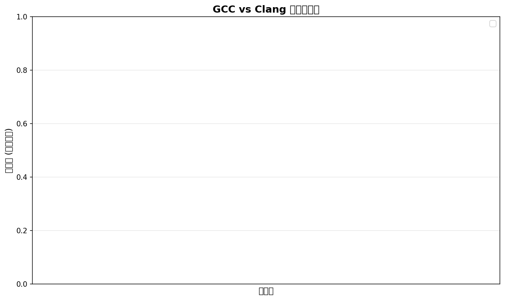
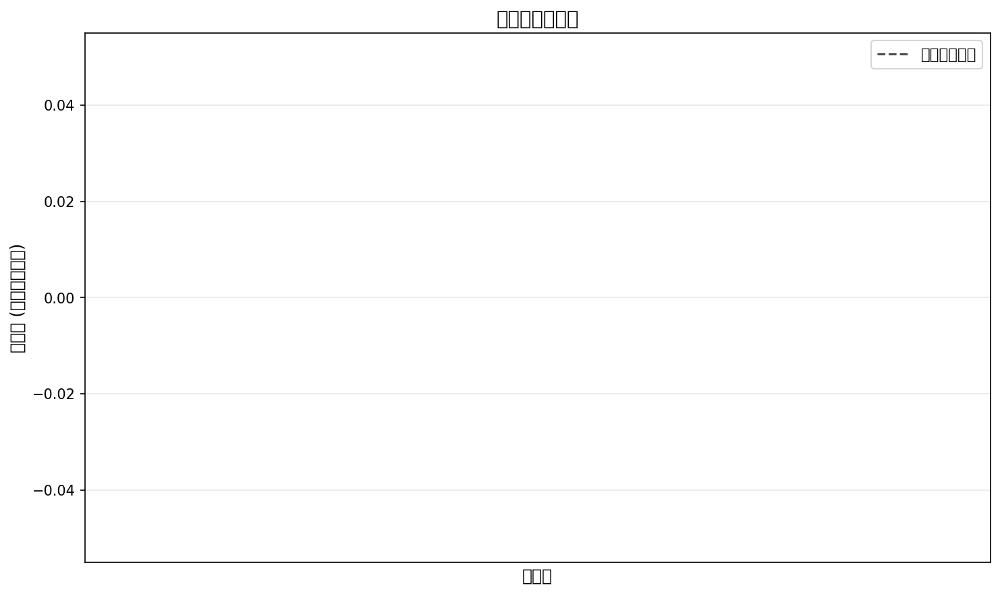

# GCC vs Clang 编译器 Benchmark 报告

**生成时间:** 2026-01-27 14:41:22

## 测试环境

- **输入文件:** `fq-data/E150035817_L01_1201_1.sub10.fq.gz`
- **文件大小:** 156.60 MB (压缩前)
- **测试线程数:** 1, 4, 8

## 性能对比可视化

### 压缩速度对比

### 解压速度对比

### 压缩率对比

### 内存使用对比

### 并行扩展性分析

## 详细数据

### 压缩性能

| 编译器 | 线程数 | 速度 (MB/s) | 压缩率 | 内存 (MB) |
|--------|--------|-------------|--------|-----------|

### 解压性能

| 编译器 | 线程数 | 速度 (MB/s) | 内存 (MB) |
|--------|--------|-------------|-----------|

## 性能分析总结

数据不足，无法生成详细对比。

---

*由 fq-compressor benchmark 框架自动生成*