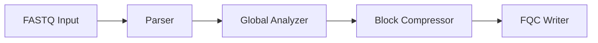

# fq-compressor GitHub Pages Redesign Implementation Plan

> **For agentic workers:** REQUIRED SUB-SKILL: Use superpowers:subagent-driven-development (recommended) or superpowers:executing-plans to implement this plan task-by-task. Steps use checkbox (`- [ ]`) syntax for tracking.

**Goal:** Rebuild the GitHub Pages site into a bilingual technical whitepaper and architecture portal with kimi-cli-aligned VitePress tooling, a new research-grade visual system, and stronger academy/research content paths.

**Architecture:** Keep the site on VitePress default-theme extension, but replace the current portal layer with a smaller set of reusable primitives driven by a shared token system. Align the docs toolchain with kimi-cli by adding Mermaid and llms.txt support, then reorganize navigation and content around overview, whitepaper, architecture, evidence, academy, and research.

**Tech Stack:** VitePress, Vue 3 SFCs, TypeScript, CSS custom properties, vitepress-plugin-mermaid, vitepress-plugin-llms

---

## File Map

- **Modify:** `docs/package.json`
- **Modify:** `docs/package-lock.json`
- **Modify:** `docs/.vitepress/config.ts`
- **Modify:** `docs/.vitepress/theme/index.ts`
- **Modify:** `docs/.vitepress/theme/style.css`
- **Replace/Create:** `docs/.vitepress/theme/components/*.vue`
- **Modify:** `docs/en/index.md`
- **Modify:** `docs/zh/index.md`
- **Create/Modify:** `docs/en/academy/*.md`, `docs/zh/academy/*.md`
- **Create/Modify:** `docs/en/research/*.md`, `docs/zh/research/*.md`
- **Modify:** `docs/en/overview/index.md`, `docs/zh/overview/index.md`
- **Modify:** `docs/en/benchmarks/*.md`, `docs/zh/benchmarks/*.md`
- **Retire or redirect in nav only:** legacy `docs/en/guides`, `docs/zh/guides`, `docs/en/resources`, `docs/zh/resources`

### Task 1: Align the docs toolchain with kimi-cli

**Files:**
- Modify: `docs/package.json`
- Modify: `docs/package-lock.json`
- Modify: `docs/.vitepress/config.ts`

- [ ] **Step 1: Add the same core docs plugins used by kimi-cli**

```json
{
  "scripts": {
    "dev": "vitepress dev",
    "build": "vitepress build",
    "preview": "vitepress preview"
  },
  "dependencies": {
    "vitepress-plugin-llms": "...",
    "vitepress-plugin-mermaid": "...",
    "mermaid": "..."
  }
}
```

- [ ] **Step 2: Install dependencies and update the lockfile**

Run: `cd docs && npm install`
Expected: `added ... packages` and an updated `package-lock.json`

- [ ] **Step 3: Rebuild VitePress config around a normalized base and plugin-wrapped export**

```ts
const rawBase = process.env.VITEPRESS_BASE;
const base = rawBase
  ? rawBase.startsWith("/") ? (rawBase.endsWith("/") ? rawBase : `${rawBase}/`) : `/${rawBase}/`
  : "/fq-compressor/";

export default withMermaid(defineConfig({
  base,
  vite: {
    plugins: [llmstxt()]
  }
}));
```

- [ ] **Step 4: Keep bilingual navigation but reframe labels around reading goals**

```ts
nav: [
  { text: "Overview", link: "/en/overview/" },
  { text: "Whitepaper", link: "/en/whitepaper/" },
  { text: "Architecture", link: "/en/architecture/" },
  { text: "Evidence", link: "/en/benchmarks/" },
  { text: "Academy", link: "/en/academy/" },
  { text: "Research", link: "/en/research/" }
]
```

- [ ] **Step 5: Verify the site still builds after config migration**

Run: `cd docs && npm run build`
Expected: `build complete`

### Task 2: Replace the current portal theme with reusable whitepaper primitives

**Files:**
- Modify: `docs/.vitepress/theme/index.ts`
- Modify: `docs/.vitepress/theme/style.css`
- Create: `docs/.vitepress/theme/components/EvidenceGrid.vue`
- Create: `docs/.vitepress/theme/components/ArchitectureAtlas.vue`
- Create: `docs/.vitepress/theme/components/ReadingTracks.vue`
- Create: `docs/.vitepress/theme/components/CitationCluster.vue`
- Retire/replace: `docs/.vitepress/theme/components/MetricStrip.vue`
- Retire/replace: `docs/.vitepress/theme/components/KnowledgeMap.vue`
- Retire/replace: `docs/.vitepress/theme/components/TopicCardGrid.vue`

- [ ] **Step 1: Register the new homepage primitives in the theme entry**

```ts
ctx.app.component("EvidenceGrid", EvidenceGrid);
ctx.app.component("ArchitectureAtlas", ArchitectureAtlas);
ctx.app.component("ReadingTracks", ReadingTracks);
ctx.app.component("CitationCluster", CitationCluster);
```

- [ ] **Step 2: Replace ad-hoc portal colors with shared tokens**

```css
:root {
  --portal-bg: #f7f9fc;
  --portal-surface: rgba(255, 255, 255, 0.84);
  --portal-border: rgba(15, 23, 42, 0.12);
  --portal-strong: #10203d;
  --portal-accent: #3e63dd;
}

.dark {
  --portal-bg: #0b1020;
  --portal-surface: rgba(17, 24, 39, 0.82);
  --portal-border: rgba(148, 163, 184, 0.2);
  --portal-strong: #e6ecff;
  --portal-accent: #82a0ff;
}
```

- [ ] **Step 3: Build components so diagrams and cards derive from the same tokens**

```vue
<article class="evidence-card">
  <p class="evidence-card__metric">3.97×</p>
  <h3>Compression ratio</h3>
  <p>Positioned beside throughput, random access, and validation evidence.</p>
</article>
```

- [ ] **Step 4: Add Mermaid-safe theme styling and SVG-friendly color inheritance**

```css
.mermaid,
.portal-diagram svg {
  color: var(--portal-strong);
  fill: currentColor;
  stroke: currentColor;
}
```

- [ ] **Step 5: Rebuild and inspect the generated site assets**

Run: `cd docs && npm run build`
Expected: `build complete`

### Task 3: Rebuild the bilingual homepage as a whitepaper landing page

**Files:**
- Modify: `docs/en/index.md`
- Modify: `docs/zh/index.md`

- [ ] **Step 1: Replace the current homepage body with a thesis-driven structure**

```md
<EvidenceGrid locale="en" />
<ArchitectureAtlas locale="en" />
<ReadingTracks locale="en" />
<CitationCluster locale="en" />
```

- [ ] **Step 2: Rewrite the hero copy so it sells system credibility, not only raw numbers**

```yaml
hero:
  name: fq-compressor
  text: FASTQ Compression Whitepaper
  tagline: Inspect the algorithmic thesis, system boundaries, benchmark evidence, and random-access archive design in one place.
```

- [ ] **Step 3: Mirror the structure in Chinese with equivalent meaning**

```yaml
hero:
  name: fq-compressor
  text: FASTQ 压缩白皮书
  tagline: 在一个入口中同时检查算法命题、系统边界、基准证据与随机访问归档设计。
```

- [ ] **Step 4: Add architecture and evidence diagrams directly on the homepage**

```md

```

- [ ] **Step 5: Build the site and confirm both locale homepages render**

Run: `cd docs && npm run build`
Expected: `en/index.html` and `zh/index.html` generated under `.vitepress/dist`

### Task 4: Reshape information architecture around Academy and Research

**Files:**
- Modify: `docs/.vitepress/config.ts`
- Create: `docs/en/academy/index.md`
- Create: `docs/en/academy/installation.md`
- Create: `docs/en/academy/getting-started.md`
- Create: `docs/en/academy/cli-workflows.md`
- Create: `docs/en/academy/contributing.md`
- Create: `docs/zh/academy/index.md`
- Create: `docs/zh/academy/installation.md`
- Create: `docs/zh/academy/getting-started.md`
- Create: `docs/zh/academy/cli-workflows.md`
- Create: `docs/zh/academy/contributing.md`

- [ ] **Step 1: Move or rewrite legacy guide content into Academy**

```md
# Academy

Use this track when your question is operational: install, run, verify, or contribute.
```

- [ ] **Step 2: Update sidebars so Academy becomes the operator/contributor lane**

```ts
"/en/academy/": [
  {
    text: "Academy",
    items: [
      { text: "Operator path", link: "/en/academy/" },
      { text: "Installation", link: "/en/academy/installation" },
      { text: "Getting started", link: "/en/academy/getting-started" },
      { text: "CLI workflows", link: "/en/academy/cli-workflows" },
      { text: "Contributing", link: "/en/academy/contributing" }
    ]
  }
]
```

- [ ] **Step 3: Rewrite overview copy to explicitly describe the reading order**

```md
1. Read Overview for positioning.
2. Read Whitepaper for the thesis.
3. Read Architecture for implementation boundaries.
4. Read Evidence for proof.
5. Read Academy or Research depending on your role.
```

- [ ] **Step 4: Leave legacy guide directories out of nav and sidebar to avoid duplicate public paths**

Run: `rg "/(guides|resources)/" docs/.vitepress/config.ts docs/en docs/zh`
Expected: only intentional archival references remain

### Task 5: Add research-grade references, comparisons, and evolution notes

**Files:**
- Create: `docs/en/research/index.md`
- Create: `docs/en/research/references.md`
- Create: `docs/en/research/open-source-comparative-study.md`
- Create: `docs/en/research/evolution-notes.md`
- Create: `docs/zh/research/index.md`
- Create: `docs/zh/research/references.md`
- Create: `docs/zh/research/open-source-comparative-study.md`
- Create: `docs/zh/research/evolution-notes.md`
- Modify: `docs/en/benchmarks/index.md`
- Modify: `docs/zh/benchmarks/index.md`

- [ ] **Step 1: Create a references page with papers and repositories grouped by purpose**

```md
## Assembly-based compression
- Chandak et al. (SPRING)

## Quality-value modeling
- fqzcomp

## Reference implementations
- SPRING
- NanoSpring
- HARC
```

- [ ] **Step 2: Add a comparative-study page that explains what fq-compressor keeps, changes, or rejects**

```md
| Project | Core idea | Strength | Trade-off |
| --- | --- | --- | --- |
| SPRING | minimizer + assembly | ratio | decode complexity |
```

- [ ] **Step 3: Add an evolution-notes page describing current closeout-mode design direction**

```md
The project is in closeout mode: finishing, simplifying, and stabilizing beats feature expansion.
```

- [ ] **Step 4: Link benchmark claims to these research pages to strengthen provenance**

Run: `rg "references|comparative|evolution" docs/en docs/zh`
Expected: benchmark and research pages cross-link

### Task 6: Final validation and cleanup

**Files:**
- Verify: `docs/**/*`

- [ ] **Step 1: Run a full docs build**

Run: `cd docs && npm run build`
Expected: `build complete`

- [ ] **Step 2: Check for broken public path references after the IA rewrite**

Run: `rg "/(guides|resources)/" docs/en docs/zh docs/.vitepress`
Expected: either no matches or matches limited to archival explanation

- [ ] **Step 3: Check Mermaid usage and theme token coverage**

Run: `rg "mermaid|portal-|evidence-|atlas-|citation-" docs/.vitepress docs/en docs/zh`
Expected: new primitives and diagrams are referenced consistently

- [ ] **Step 4: Commit the docs redesign**

```bash
git add docs/package.json docs/package-lock.json docs/.vitepress docs/en docs/zh docs/superpowers
git commit -m "docs: rebuild GitHub Pages as whitepaper portal"
```
