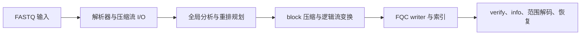

<EvidenceGrid locale="zh" />

<ArchitectureAtlas locale="zh" />

## 这个站点想论证什么

这里把 fq-compressor 当作一份技术论证来呈现，而不是营销页。一个真正可用的 FASTQ 压缩器，不应该只靠一张压缩率图表成立。它必须让压缩密度、吞吐、随机访问语义、格式设计与仓库可追溯证据彼此咬合。

这里的阅读顺序是刻意安排过的：先理解命题，再理解让命题可落地的边界，最后回到约束公开主张的证据链。

<ReadingTracks locale="zh" />

<CitationCluster locale="zh" />
